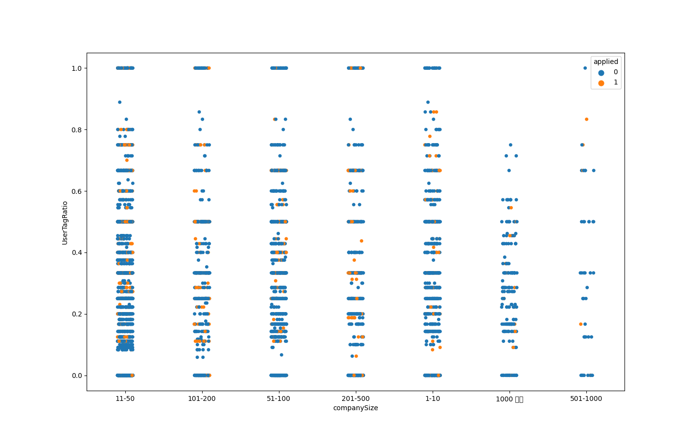
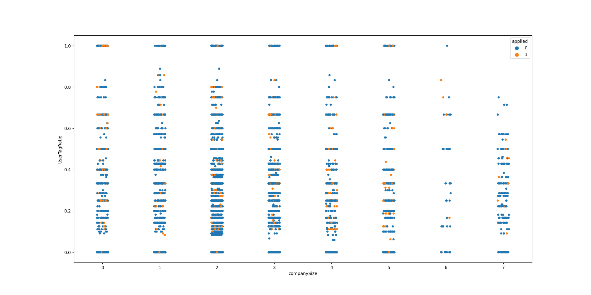
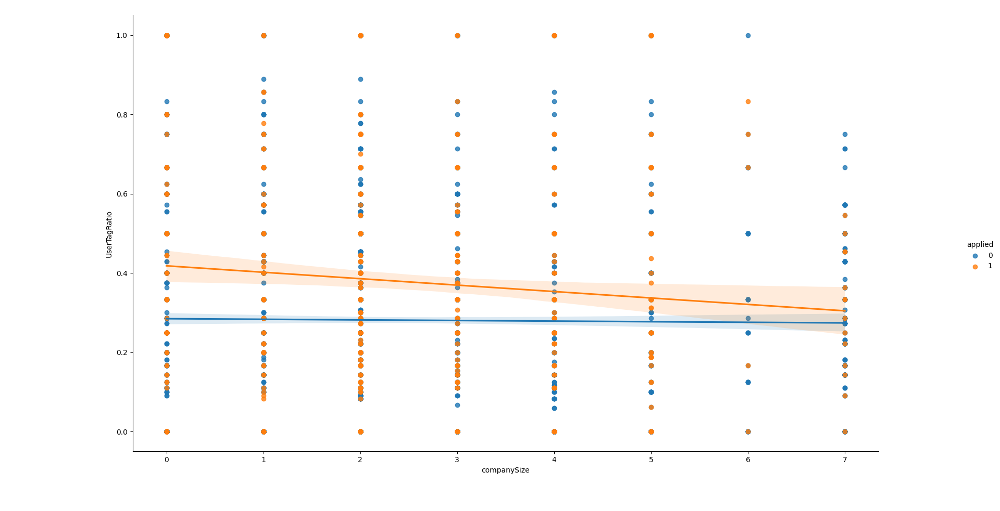
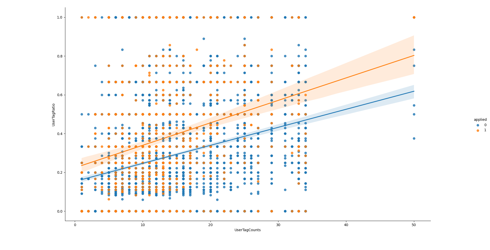
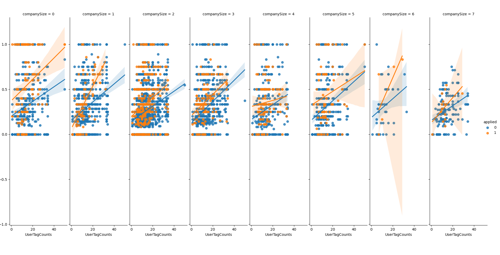

# Programmers 과제란 - 채용 공고 추천

---
# 풀이 과정
절차적 순서대로 작성하였다.     

## train.csv 구성
`userID`는 개발자 ID.      
`jobID`는 구인공고 ID.      
`applied`는 해당 구인 공고에 지원했다면 1, 아니라면 0으로 나타낸다.        

userID랑 jobID가 무엇을 구체적으로 알 필요가 있으므로 세부적으로 파고 들어간다.      

## job_tags.csv
`jobID`는 구인공고 ID.      
`tagID`는 해당 구인공고의 키워드 ID.       
구인공고에 여러 키워드들이 존재할 수 있다고 했다.        
예를 들어, 네이버 랩스 공고에 "tensorflow", "keras", "bigdata", "python" 등 있다는 뜻이다.     

태그 ID는 무엇인지 파고 들려면 `tags.csv`를 열어보면 된다.       

## user_tags.csv
`userID`는 개발자 ID.       
`tagID`는 해당 개발자가 가지고 있는 키워드 ID.     
즉, 개발자는 여러 키워드를 가질 수 있다.        
예를 들어, 나는 "python", "c++", "tensorflow", "keras" 등 가지고 있다면
| userID | tagID |
| :---: | :---: |
| alsrua | python |
| alsrua | c++ |
| alsrua | tensorflow |
| alsrua | keras |
| ... | ... |
이렇게 표현될 것 이다.       

## tags.csv
`tagID`는 말 그대로 키워드 ID.      
`kerword`는 해당 아이디를 할당받은 실제 값이다.     
즉, "python"을 암호화하여 만든 키가 tagID다.       
해당 tagID를 복호화하면 "python"이 나온다.      

## job_companies.csv
`companyID`는 회사 ID.        
`jobID`는 구인공고 ID.       
`companySize`는 회사의 크기.      
이 파일은 구인공고 ID랑 연관된 회사 ID가 어디인지 정보를 나타낸 파일이다.       
그런데, 이 값은 존재하지 않을 수도 있다.(결측값 발생)        

결측값이 있다면 그 값을 제외시키는 방법을 고려한다.       

## test.csv
`userID`와 `jobID`는 위와 같다.       
이는 최종 예측 모델의 입력이 되는 파일로 쓰라고 하는 것 같다.        

---

여기까지 파일 구성에 대해서 다 알아봤으니, 어떻게 해야 효과적으로 전처리하고 정확률을 보다 더 높게 만들 수 있을까를 생각해 본다.

# Binary Classifier
0과 1로 나뉘어지는 이진 분류 모형으로 모델 구축해야 한다.      
이유는 해당 개발자가 어느 공고에 지원을 할까? 말까? 라는 예측을 하는 결과를 원하기 때문이다.      
그러면 이진 분류기 모형 중에서 적합한 것은 모르니, 다 시도를 해보면서 정확률이 높은 모델이 무엇인지 알면 된다.        


## 데이터 정형
우선 데이터 정형할 필요가 있다.      
`train.csv`를 열어서 지원한 이력들만 조회했더니, 857개가 있다.      
한번 생각해보자, 이 과제의 최종 목표는 이 지원자가 해당 구인공고에 지원할까? 말까? 라는 예측으로 하는 것이므로,       
지원자의 기술 스택과 요구하는 기술 스택이 점점 일치할 수록 지원할 가능성이 높다고 보면 된다.       
즉, 지원자의 태그 아이디과 구인 공고의 태그 아이디들을 비교하면서 (일치한 개수) / (전체 개수)으로 퍼센트 비율을 구하면 되겠다.     

```python
def getUserTagRatio(trains, job_tags, user_tags) -> pd.DataFrame:
    """
    :param train: 학습 파일 데이터
    :param tag: 태그 파일 데이터
    :return pd.DataFrame: train데이터에 UserTagRatio 열을 추가한 pandas 객체 생성 및 반환.
    :except param::train is not pandas class: None 반환.
    """

    if not IsPandasDataFrame(trains):
        return None
    # 반환할 객체에 train 데이터 복사.
    result = trains.copy()

    # 지원자가 가지고 있는 기술 스택 수집.
    # 회사가 요구하는 기술 스택 수집.
    # 수집하는 이유는 (시간 절약을 위해 HashMap 활용).
    User_Tags = {}
    for userID in trains['userID'].values:
        User_Tags[userID] = set()
        User_Tags[userID].update(user_tags[user_tags['userID'] == userID]['tagID'].values)
    Job_Tags = {}
    for jobID in trains['jobID'].values:
        Job_Tags[jobID] = set()
        Job_Tags[jobID].update(job_tags[job_tags['jobID'] == jobID]['tagID'].values)

    # 1부터 끝까지 탐색하면서 비율 추가한다.
    UserTagRatio = []
    for userID, jobID, applied in trains.values:
        count = 0
        length = len(Job_Tags[jobID])
        for tagID in Job_Tags[jobID]:
            if tagID in User_Tags[userID]:
                count += 1
        UserTagRatio.append(count / length)

    result.loc[:, 'UserTagRatio'] = UserTagRatio
    return result
```


구체적으로 풀이를 쓰면, 회사가 요구하는 기술 스택 중에서 지원자의 기술 스택이 있다면 `일치한 개수`, `전체 개수` 두 변수를 1씩 증가시키고, 없다면 `전체 개수` 변수만 1씩 증가 시킨다.       
즉, `userID`가 가지고 있는 `tagID`들을 `jobID`가 가지고 있는 `tagID`들을 매칭시켜보면서 해야 한다.      
이렇게 비율을 완성 시킨 후 Pandas Dataframe 새로운 객체에 train 데이터과 새로운 열인 `UserTagRatio`를 추가한다.

```python
if not os.path.isfile(r"C:\Users\KMK\Desktop\train_job\train2.csv"):
    trains = pd.read_csv(r"C:\Users\KMK\Desktop\train_job\train.csv")
    tags = pd.read_csv(r"C:\Users\KMK\Desktop\train_job\tags.csv")
    job_tags = pd.read_csv(r"C:\Users\KMK\Desktop\train_job\job_tags.csv")
    user_tags = pd.read_csv(r"C:\Users\KMK\Desktop\train_job\user_tags.csv")
    trains = getUserTagRatio(trains, job_tags, user_tags)
    if trains is None:
        print("getUserTagRatio return => None")
        exit(0)
    else:
        trains.to_csv(r"C:\Users\KMK\Desktop\train_job\train2.csv", index=False, sep=',')
else:
    trains = pd.read_csv(r"C:\Users\KMK\Desktop\train_job\train2.csv")
```

같은 과정을 또 하고 싶지 않기에 파일을 저장해서 이 파일이 있다면 불러오기만 하면 되는 형식으로 하였다.

그 다음, `job_companies.csv` 파일에 대해서 한번 생각해봐야 한다. 왜 회사의 규모라는 옵션 필드를 줬을까?       
설마 회사 규모를 보고 지원하는 사람들? 나도 대기업에 자주 지원하는 심리상으로 맞는 것 같았다.      
그래서 `jobID`로 매칭시킨 다음에 `companySize`를 반환하여 바인딩 해준다.      

과연 회사의 규모에 따라 지원 횟수가 늘어나는지 검증해보겠다.      

        

음 봐도 모르겠다. 특징적인 패턴을 안 보인다.      
그러면 범주형 x축 값을 전부 수치형 순서로 바꿔서 본다.
```text
범주형 순서값은 전부 수치형 순서로 바꿔준다.
범주형 목록 - nan, 1-10, 11-50, 51-100, 101-200, 201-500, 501-1000, 1000 이상
수치형 목록 - 0, 1, 2, 3, 4, 5, 6, 7
```

        
잘 보인다.
뭐랑 연관되어 있는지 `y = ax + b` 꼴로 나타내면서 본다.       
즉 선형회귀 모델이랑 적합한지 본다.        

        

회사 규모가 클수록 해당 공고에 지원한 선형회귀가 점점 떨어진다.        
하지만 지원안한 선형회귀는 거의 유지되어 있다.      
이러면 회사 규모에 따라 지원자의 일치한 스택의 비율이 더 높다는 사실이 아님을 입증되었다.     

어떻게 풀어야 할지 난감스럽다.       
그러면 유저가 가지고 있는 스택의 개수에 따라서 다를까?를 한번 생각해보았다.     

새로운 `UserTagCounts` 열을 추가한다. 계산식은 유저가 가지고 있는 모든 태그의 개수를 구하고 1번부터 끝까지 다 구해놓는다.       
바인딩 해준다.        
```python
def getUserTagCounts(trains, user_tags) -> pd.DataFrame:
    if not IsPandasDataFrame(trains):
        return None

    result = trains.copy()

    # 유저 태그 수집하면서 기록.
    UserTagCounts = []
    User_Tags = {}
    for userID in trains['userID'].values:
        if userID not in User_Tags:
            User_Tags[userID] = 0
            tmp = set()
            tmp.update(user_tags[user_tags['userID'] == userID]['tagID'].values)
            User_Tags[userID] = len(tmp)
        UserTagCounts.append(User_Tags[userID])

    result.loc[:, 'UserTagCounts'] = UserTagCounts
    return result
```
자 한번 출력해보자.

```python
seaborn.lmplot(y="UserTagRatio", x="UserTagCounts", hue="applied", data=trains)
plt.show()
```

        

옳거니! 지원자의 스펙이 높을수록 일치한 스펙의 비율이 높은 회사에 지원하는 경향이 더 커보이는 분석 결과가 나왔다.       
그러면 지원자의 스펙 개수랑 일치한 스펙 비율와 회사 규모에 연관 관계가 있는지 한번 보자.     

        

음. 대체적으로 공고에 지원한 사람들의 선형 관계식이 지원안한 사람들의 선형 관계식보다 높다는 것을 알 수 있었다.        

자 이제 학습을 시킬 때가 왔다.      

---

# ML
일단 변수 관계 간을 보았을 때, 분류보다 회귀 쪽에 어울리는 것 같으니 한번 시도해본다.     
회귀 쪽에 정확도가 분류 쪽의 정확도보다 낮으면 분류 문제는 역시 분류로 해야한다는 것을 공부할 것이다.      

## 회귀
회귀 쪽으로 풀려다가 전부 다 0으로 예측되는 현상이 일어났다.     
~~문제는 결과 정확률이 85.6% ㅋㅋㅋㅋㅋㅋㅋㅋㅋㅋㅋ~~       
회귀가 아님을 알았고, 분류 모델로 사용했다.       

## 분류
필자는 Decision Tree(결정 트리) 기법을 사용해봤으나, 정확률은 81%가 되었다.     
사용한 변수는 `UserTagRatio`, `UserTagCounts`, `companySize` 등 3가지를 썼다.       
이는 81% 정확률이 나왔고, 예상한대로 `companySize`뺀 두 변수로 해봤더니 84%가 떴다.       
하지만 84%는 엉망진창임을 알 수 있다.
앙상블 기법인 Random Forest 기법을 사용하니까,        
Decision Tree 기법보다 살짝 더 오른 84.6%가 되었다.      

아무래도 하이퍼 매게변수들을 잘못 선택한 것으로 보인다. 왜냐하면        
전부 0으로 된 파일을 제출하니까 85.6%더라...       
변수들 중에서 제일 중요한 요소가 무엇인지 고찰할 필요가 있다.     

---

결국 시간 안에 해결하지 못하고 84.6%로 솔직하게 제출하기로 했다.     

정리하자면       
1. 데이터 정형
2. `UserTagRatio`와 `UserTagCounts` 연관 관계가 있음.
3. 두 변수로 결정 트리에 앙상블 기법을 추가해서 84.6% 정확률 도출함.
4. 0으로만 되어 있는 파일은 85.6%이다.
5. 망했다.

개인적으로 너무 재밌었다. 게다가 변수 요소를 잘 고려해야 한다는 점을 아주 잘 느껴졌다.      
